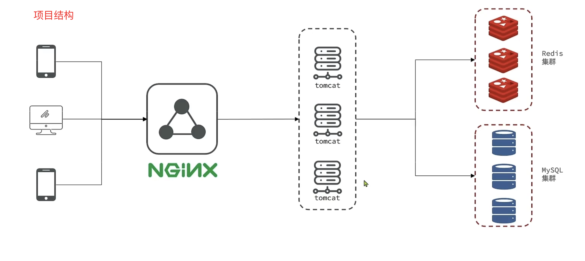
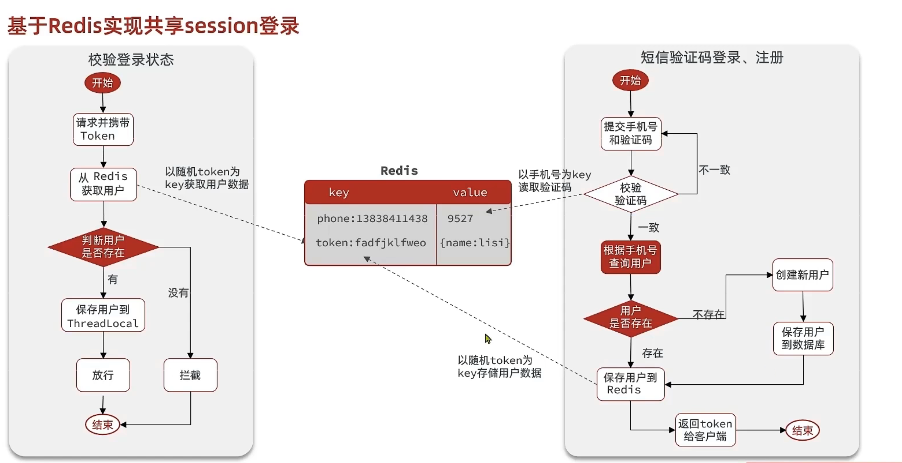
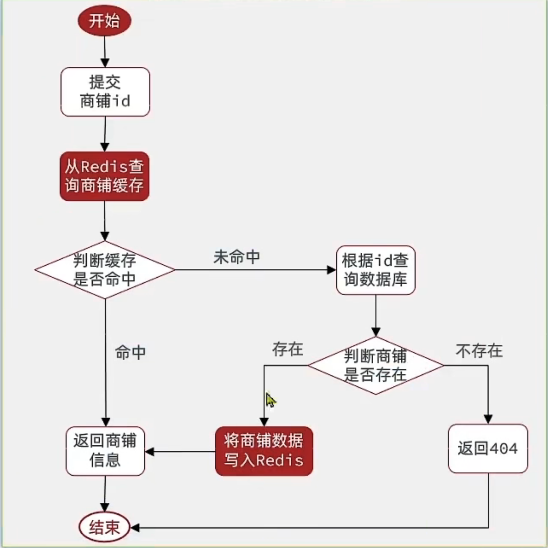
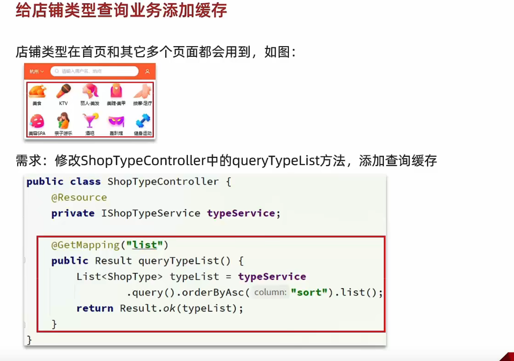
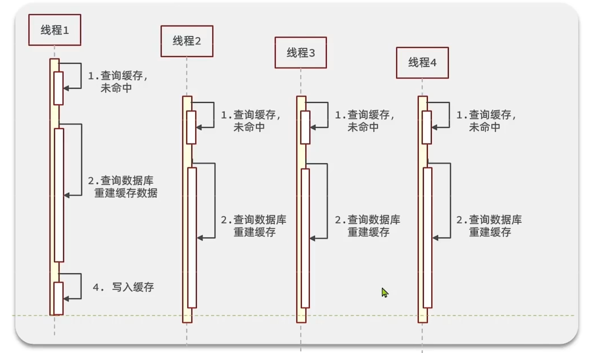
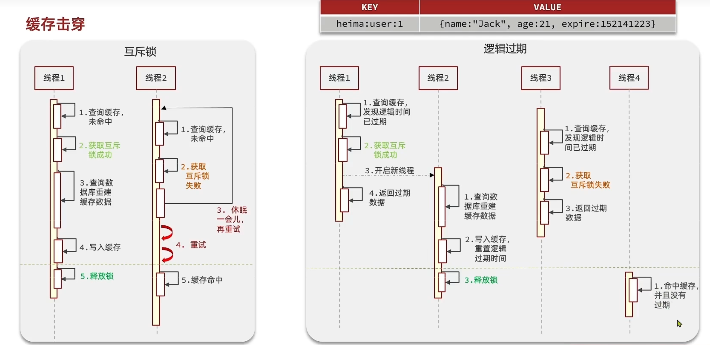
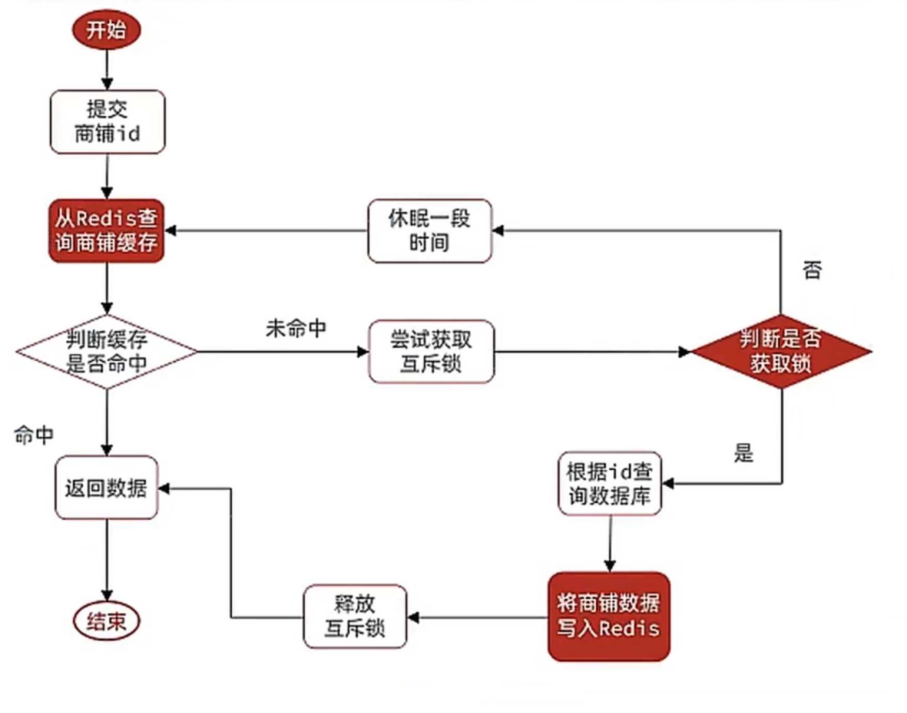

# heima-redis

## redis黑马点评介绍

## 功能介绍

###### 

## 项目结构

######  

## 短信登录模块

### Session问题

1、多台Tomcat之间并不共享Session存储空间，当请求切换到不同的服务器时会导致数据丢失的问题。

2、Session在重启服务器时也会将数据丢失。

### Session替代方案

- 数据共享
- 内存存储
- key、value结构

### 基于Redis实现共享Session登录

- 验证码存储使用String结构
- 用户信息存储
  - 字符串结构：将对象序列化为JSON存储在Redis中。
  - HASH结构：将对象的每个字段进行存储，支持单个字段CRUD，内存占用比String更少

###### 

### 拦截器优化

.

**新增token拦截器：负责刷新redis中token的有效时间**

## 商户查询模块

#### 1、店铺增加缓存

#### 2、练习：店铺类型查询业务添加缓存

#### 3、缓存更新策略

- 内存淘汰：不用自己维护，利用Redis的内存淘汰机制，当内存不足时淘汰部分数据，下次查询时更新缓存。一致性弱、维护成本无
- 超时剔除：给缓存数据添加TTl时间，到期后自动删除数据，下次查询时更新缓存。一致性一般，维护成本低
- 主动更新：编写业务代码逻辑，在修改数据库的同时，更新缓存。一致性好，维护成本高

​    **业务场景**：

 低一致性需求：数据长期不发生改变，可采用Redis中自带的内存淘汰策略。

高一致性：数据时常需要改动，可采用主动更新+设置过期时间来确保缓存一致性。

读操作：

缓存命中直接返回，缓存未命中先查询数据库，数据库查询后更新缓存并设置超时时间。

写操作：

先写后删，使用Spring事务或TCC补偿，来保证数据库和缓存的数据一致性。

#### 4、实现商铺缓存和数据的双写一致性

(1) 查询时设置过期时间

(2) 修改时先更新数据库再删除redis，使用@Transactional注解保证事务操作

#### 5、缓存问题

- 缓存穿透：客户端发出的请求在缓存和数据库中都未命中，则为缓存穿透。

    - 缓存空对象：当缓存和数据库中都查询不到数据时，则缓存一个空对象并设置TTL过期时间；优点：实现简单，缺点：额外内存消耗，可能导致数据不一致。
    - 布隆过滤：前置过滤器，用于检测缓存中的数据是否存在，不存在直接返回，存在则继续向下查询

- 缓存雪崩：同一时间段大量的缓存key同时失效或者Redis服务宕机，导致大量请求到达数据库。

    - 给Key设置不同的TTL随机值
    - 提高redis的可用性(使用集群方案哨兵机制)
    - 使用sentinel给缓存业务添加降级限流策略
    - 给key不设置TTL，永不过期
    - 给业务添加多集缓存

- 缓存击穿：热点key被高并发访问并且key的缓存失效了，无数的请求越过缓存直接请求数据库

  时序图：

  解决方案：

  

    - 互斥锁方案：多个线程进行查询时，对数据加互斥锁处理，保证同一时间只有一个线程请求数据库进行缓存重建，其他线程休眠等待；
        - 优点：保证了数据的一致性；
        - 缺点：牺牲了系统的可用性，如果重构时间过长，其他的请求都需要等待。并且还有死锁风险。
    - 逻辑过期方案：在缓存的数据中增加一个新的逻辑过期字段，当查询请求来后，先判断当前时间是否过期，如果过期获取锁并开启新线程负责缓存重建，自己则直接返回旧数据，其他线程访问时，同样尝试获取锁，获取不到则直接返回已过期数据。
        - 优点：性能好，系统可用性大大增强。
        - 缺点：有额外内存消耗，在数据的可用性和一致性之间选择了可用性，牺牲了强一致性。实现复杂。

  流程图：

  互斥锁方案解决缓存击穿：

逻辑删除解决缓存击穿：

./images

