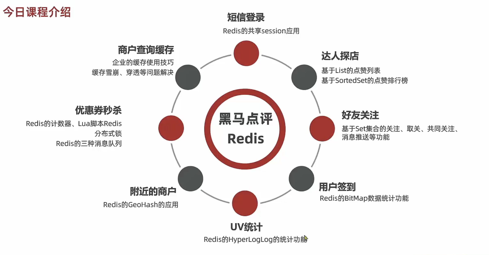

# heima-redis

## redis黑马点评介绍

## 功能介绍

## 项目结构

![![功能介绍]](./images/项目结构.png)

## Session问题

1、多台Tomcat之间并不共享Session存储空间，当请求切换到不同的服务器时会导致数据丢失的问题。

2、Session在重启服务器时也会将数据丢失。

## Session替代方案

- 数据共享
- 内存存储
- key、value结构

## 基于Redis实现共享Session登录

- 验证码存储使用String结构
- 用户信息存储
    - 字符串结构：将对象序列化为JSON存储在Redis中。
    - HASH结构：将对象的每个字段进行存储，支持单个字段CRUD，内存占用比String更少

